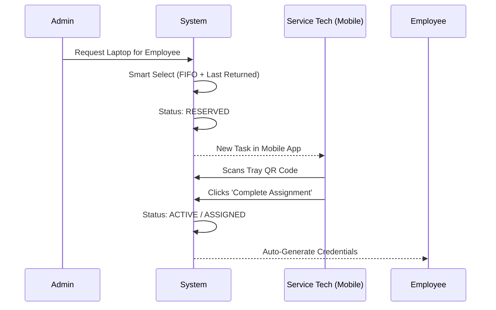
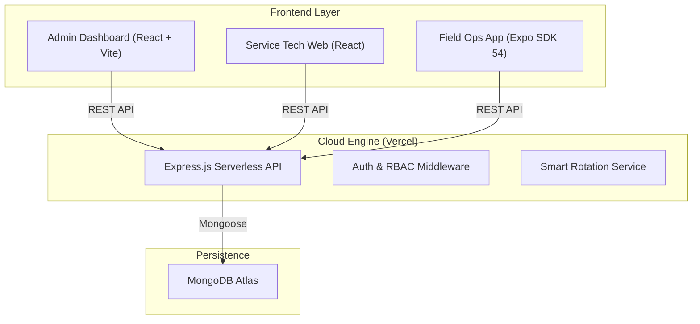

# 🚀 GearPilot — Smart IT Asset & Inventory Management Platform

<div align="center">
  <p><i>A production-grade, full-stack ecosystem for enterprise hardware lifecycle management.</i></p>

  [](https://github.com/NS145/GearPilot)
  [](https://gear-pilot.vercel.app)
  [](LICENSE)
</div>

---

## 📌 Project Overview

**GearPilot** is a professional MERN (MongoDB, Express, React, Node) platform designed to solve the "chaos" of physical IT asset management. Unlike simple CRUD apps, GearPilot implements a **hardware lifecycle** including Smart Allocation, QR-based fulfillment, and high-security role-based access.

### 🎥 How it Works (The Core Logic)



---

## 🏗️ System Architecture

GearPilot is built as a **Monorepo** for seamless full-stack orchestration:



---

## ✨ Key Features

- **📊 360° Dashboard**: Track fleet health, availability, and return rates.
- **🛡️ RBAC (Role-Based Access)**: Admins manage inventory; Service Techs handle physical fulfillment.
- **🤖 The "Smart Assign" Engine**:
    - **Priority 1**: Assign the laptop that was most recently returned (to ensure rotation).
    - **Priority 2**: If no recent returns, assign the oldest purchase (FIFO).
- **📸 QR Scanner Integration**: Built-in mobile scanner to verify tray/laptop identity before hand-off.
- **🏷️ Instant QR Generation**: Generate and download labeled QR stickers for every physical tray.

---

## 🚀 Deployment Guide (Student Friendly)

### 1. Prerequisites
- [Node.js](https://nodejs.org/) (v18+)
- [MongoDB Atlas](https://www.mongodb.com/cloud/atlas) account
- [Vercel](https://vercel.com/) CLI (`npm i -g vercel`)
- [Expo Go](https://expo.dev/client) app on your phone

### 2. Environment Variables
Create a `.env` file in the `server/` directory:
```env
PORT=5000
MONGODB_URI=your_mongodb_connection_string
JWT_SECRET=any_random_secure_string
JWT_EXPIRE=7d
```

### 3. Local Setup
```bash
# 1. Clone
git clone https://github.com/NS145/GearPilot.git && cd GearPilot

# 2. Run Backend
cd server && npm install && npm run dev

# 3. Run Frontend
cd ../client && npm install && npm run dev

# 4. Run Mobile
cd ../mobile && npm install && npx expo start
```

### 4. Vercel Deployment (Production)
```bash
# From the root directory:
vercel --prod
```
*Note: Ensure you add your MongoDB and JWT variables in the Vercel Dashboard settings.*

---

## 📂 Folder Structure

- `server/`: Express API, Mongoose Models, and Assignment Logic.
- `client/`: React Frontend with Vite, Tailwind CSS, and Admin/Service modules.
- `mobile/`: Expo React Native app with `expo-camera` integration.

---

## 🤝 Contributing
Built for CS students and IT managers alike. Pull requests are welcome!

---

## 📄 License
MIT License. Created by [NS145](https://github.com/NS145).
