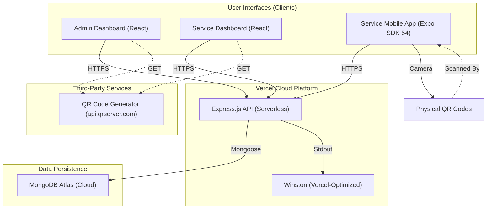

# 🚀 GearPilot — Smart IT Asset & Inventory Management Platform

<div align="center">
  
  <br>
  <p><i>A production-grade, full-stack ecosystem for enterprise hardware lifecycle management.</i></p>

  [](https://github.com/NS145/GearPilot)
  [](https://gear-pilot.vercel.app)
  [](http://makeapullrequest.com)
</div>

---

## 🏗️ Service Architecture



---

## 📌 Overview

**GearPilot** is an advanced MERN application designed to automate IT asset tracking. It bridges the gap between physical warehouse management and digital inventory records through **QR integration** and an **asynchronous request-fulfillment workflow**.

### 🔄 The GearPilot Workflow
1.  **Request (Admin)**: The Admin selects an employee and requests a laptop. The system automatically reserves the best device based on rotation logic.
2.  **Notification (Service)**: The request appears in the Service Tech's dashboard/app.
3.  **Fulfillment (Mobile)**: The Service Tech locates the tray, scans the physical **QR Code**, and clicks **"Complete Assignment"** to hand off the device.
4.  **Tracking**: The system logs the fulfillment and provides the employee with their credentials.

---

## ✨ Features

- **📊 Intelligent Dashboard**: Real-time analytics on fleet health and rotation cycles.
- **🛡️ Secure RBAC**: Strict role separation between Admins (Managers) and Service Techs (Field Ops).
- **🤖 Smart Rotation**: Priority-based allocation (FIFO + Most recently returned) to ensure equal wear.
- **📸 QR-First Ecosystem**: Instant lookup and status updates via mobile QR scanning (Expo SDK 54).
- **☁️ Vercel Native**: Fully optimized for serverless deployment with customized cloud logging.

---

## 🛠 Tech Stack

### Server (Backend)
- **Runtime**: Node.js & Express (Vercel Serverless)
- **Database**: MongoDB Atlas
- **Security**: JWT Auth + RBAC Middleware
- **Validation**: Joi Schema Validation
- **Logging**: Winston (Optimized for read-only cloud filesystems)

### Client (Web Dashboard)
- **Framework**: React 18 + Vite
- **Styling**: Tailwind CSS + Glassmorphism
- **Icons**: Lucide React

### Mobile (Scanner App)
- **Framework**: Expo SDK 54 + React Native
- **Camera**: Modern `expo-camera` API (CameraView)
- **State**: React Navigation 7 + Axios

---

## ⚙️ Setup & Installation

### Step 1: Clone & Install
```bash
git clone https://github.com/NS145/GearPilot.git
cd GearPilot
```

### Step 2: Server Setup
```bash
cd server
npm install
npm run dev
```

### Step 3: Client Setup
```bash
cd client
npm install
npm run dev
```

### Step 4: Mobile Setup
```bash
cd mobile
npm install
npx expo start
```

---

## 🤝 Contributing
We use **Conventional Commits** (`feat:`, `fix:`, `docs:`, `ui:`).

---

## 📄 License
MIT License. Built with ❤️ by [NS145](https://github.com/NS145)
