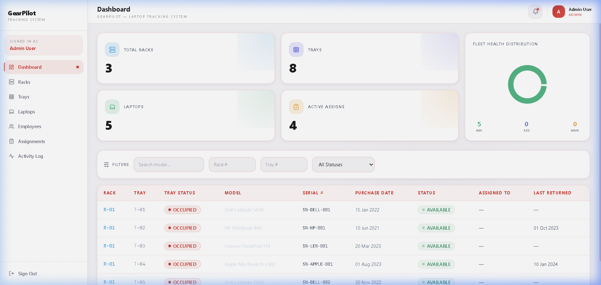
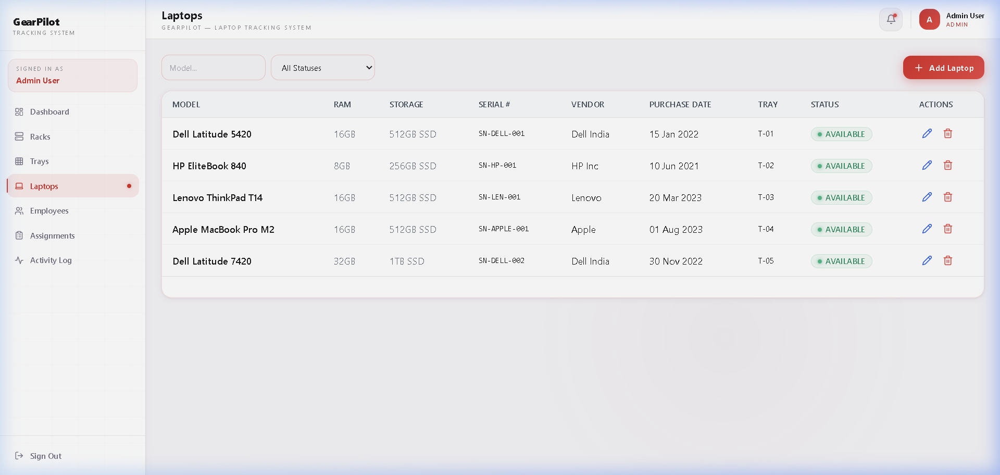
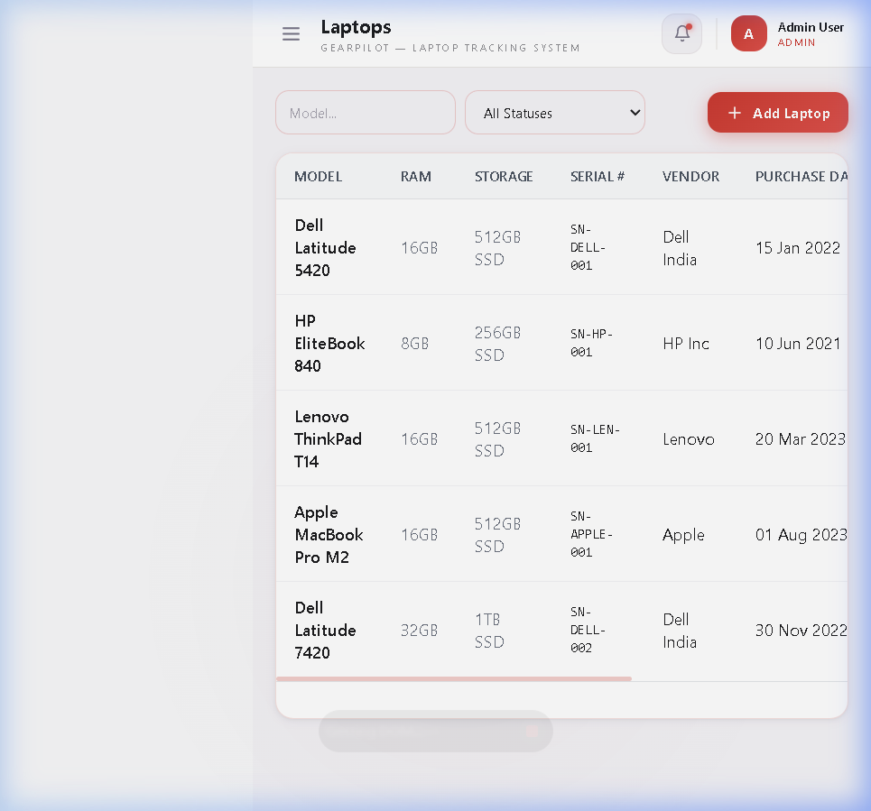

# 🚀 GearPilot — Smart IT Asset & Inventory Management Platform

<div align="center">
  
  <br>
  <p><i>A production-grade, full-stack ecosystem for enterprise hardware lifecycle management.</i></p>

  [](https://github.com/NS145/GearPilot)
  [](LICENSE)
  [](http://makeapullrequest.com)
</div>

---

## 📌 Overview

**GearPilot** is an advanced MERN (MongoDB, Express, React, Node) application designed to automate the tracking and allocation of IT assets (primarily laptops) across large organizations. It bridges the gap between warehouse physical management and digital inventory records through real-time synchronization, QR integration, and an intelligent allocation engine.

### Why GearPilot?
- ⚡ **Efficiency**: Reduces asset allocation time by 70% through automated "Smart Assign" logic.
- 🔍 **Transparency**: Full audit trail of every device's lifecycle.
- 📱 **Mobility**: Mobile-first scanning for warehouse staff in the field.

---

## ✨ Features

- **📊 Intelligent Dashboard**: Real-time analytics on fleet health, status distribution, and rotation cycles.
- **🛡️ Secure RBAC**: Role-Based Access Control ensuring only authorized personnel can modify critical inventory.
- **🤖 Smart Allocation**: Proprietary algorithm (FIFO + Rotation-based) to ensure equal wear across the fleet.
- **📸 QR Integration**: Instant lookup and status updates via mobile QR scanning.
- **📅 Lifecycle Tracking**: Automated history of returns, maintenance, and assignments.
- **📈 Advanced Filtering**: Search by model, serial number, rack position, or employee.

---

## 🛠 Tech Stack

### Server (Backend)
- **Runtime**: Node.js & Express
- **Database**: MongoDB (Mongoose ODM)
- **Security**: JWT Authentication, Bcrypt hashing, Rate-limiting
- **Validation**: Joi Schema Validation
- **Logging**: Winston Professional Logger

### Client (Web Dashboard)
- **Framework**: React.js 18 + Vite
- **Styling**: Tailwind CSS + Glassmorphism Design
- **Icons**: Lucide React
- **State Management**: Context API

### Mobile (Scanner App)
- **Framework**: React Native + Expo
- **Hardware**: QR/Barcode camera integration
- **Networking**: Axios with centralized API client

---

## 📸 Visual Proof

### Admin Dashboard


### Inventory Management


### Available Laptops


---

## ⚙️ Setup & Installation

### 📋 Prerequisites
- **Node.js** (v18+)
- **MongoDB** (Local or Atlas)
- **Expo Go** app for mobile testing

### Step 1: Clone & Install
```bash
git clone https://github.com/NS145/GearPilot.git
cd GearPilot
```

### Step 2: Server Setup
```bash
cd server
npm install
cp .env.example .env  # Configure your MONGODB_URI and JWT_SECRET
npm run seed           # (Optional) Seed database with demo data
npm run dev
```

### Step 3: Client Setup
```bash
cd client
npm install
npm run dev
```

### Step 4: Mobile Setup
```bash
cd mobile
npm install
npx expo start
```

---

## 📁 Project Structure

```text
GearPilot/
├── 📂 client/          # Vite + React web dashboard
├── 📂 server/          # Node.js + Express API
├── 📂 mobile/          # Expo + React Native app
├── 📂 docs/            # Technical documentation & API specs
└── 📂 screenshots/     # Visual assets for branding
```

---

## 🤝 Contributing

We use **Conventional Commits** to keep the history clean:
- `feat:` for new features
- `fix:` for bug fixes
- `docs:` for documentation changes
- `ui:` for design/styling improvements

---

## 📄 License
This project is licensed under the MIT License - see the [LICENSE](LICENSE) file for details.

Built with ❤️ by [NS145](https://github.com/NS145)
